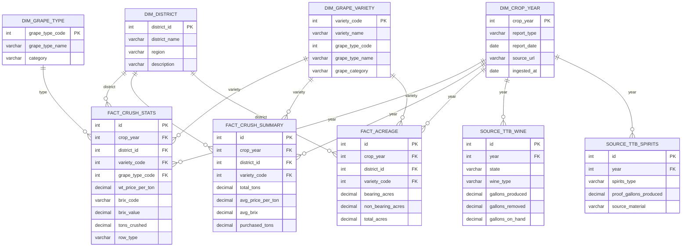
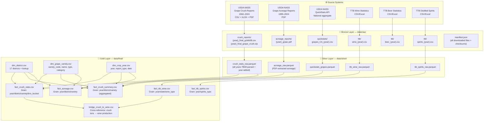
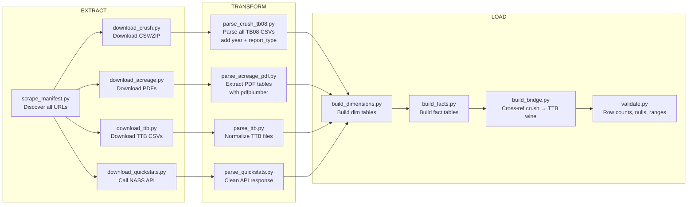

# EPIC: usda-data-crush-stats

**Repo:** `crtjer/usda-data-crush-stats`
**Goal:** Repeatable data pipeline that ingests USDA NASS California Grape Crush statistics + related beverage alcohol datasets into raw and normalized/analytical layers.
**Stack:** Python 3.11+, pandas, requests, openpyxl, pdfplumber, duckdb (optional), GitHub Actions for scheduling
**Git Identity:** crtjer / crtjer@gmail.com
**GitHub Token:** /home/home-assistant/.openclaw/credentials/github.json → token field

---

## Data Discovery Summary

### Primary Dataset: USDA NASS California Grape Crush Reports
**URL:** https://www.nass.usda.gov/Statistics_by_State/California/Publications/Specialty_and_Other_Releases/Grapes/Crush/Reports/index.php

**Available years:** 1960–2024
- 1960–2015: PDF only
- 2016–2024: ZIP (10 XLSX tables) + standalone TB08 CSV (machine-readable)
- Reports come in 3 types: Final, Preliminary, Errata

**TB08 CSV Schema (machine-readable — PRIMARY source for pipeline):**
```
district           INTEGER  -- 1-17 (California Grape Pricing Districts) + 18=State Total
grape_type_code    INTEGER  -- 5=Raisin, 6=Table, 7=Wine White, 8=Wine Red/Black
grape_type_name    VARCHAR  -- e.g. "Wine Grapes (White)", "Raisin Grapes"
variety_code       INTEGER  -- e.g. 7004=Chardonnay, 7062=Albarino
variety_name       VARCHAR  -- e.g. "Chardonnay *", "Cabernet Sauvignon"
wt_price           DECIMAL  -- Weighted average price per ton (USD)
brix_code          VARCHAR  -- Contract type / Brix range code (e.g. "024500" = 24.5 Brix)
tons               DECIMAL  -- Tons crushed in this price bucket
row_type_code      INTEGER  -- 2=data_row, 3=summary_row
row_type_name      VARCHAR  -- "data_row" or "summary_row"
```

**10 XLSX Tables per year (in ZIP):**
| Table | Description |
|-------|-------------|
| TB01 | State totals: Tons, Avg Brix, Purchased Tons, Avg Price — by Type & Variety (current vs prior year) |
| TB02 | Tons crushed by Variety & District (pivot: columns = 17 districts + state) |
| TB03 | Weighted Avg Brix by Variety & District (wine grapes) |
| TB04 | Tons by Variety & District (table grapes used for wine/concentrate/juice) |
| TB05 | Avg Brix by Variety & District (raisin grapes) |
| TB06 | Weighted Avg Price ($/ton) by Variety & District (all types) |
| TB07 | Historical — Distilling material: Tons, Avg Brix, Avg Price by year |
| TB08 | Machine-readable flat file (PRIMARY — same as standalone CSV) |
| TB09 | Tons by Variety, Price Range bucket & District |
| TB10 | Avg Price by Variety & District (10 largest processors) |

### Related Dataset 2: USDA NASS Grape Acreage Reports (California)
**URL:** https://www.nass.usda.gov/Statistics_by_State/California/Publications/Specialty_and_Other_Releases/Grapes/Acreage/index.php
**Format:** Annual PDF (1999–2024) + summary PDFs
**Data:** Bearing/non-bearing acreage by variety, county, grape type

### Related Dataset 3: USDA NASS QuickStats API (National)
**URL:** https://quickstats.nass.usda.gov/api
**Format:** JSON/CSV via REST API (requires free API key registration)
**Relevant queries:**
- commodity_desc=GRAPES, statisticcat_desc=CRUSHED, state_alpha=CA
- commodity_desc=WINE, sector_desc=CROPS
**Note:** Returns up to 50,000 rows. Good for national comparisons.

### Related Dataset 4: TTB Wine Statistics
**URL:** https://www.ttb.gov/statistics (navigate to Wine section)
**Format:** CSV/Excel annual files
**Data:** Wine production volumes, removals, stocks by state & wine type (still/sparkling/dessert)

### Related Dataset 5: TTB Beer Statistics
**URL:** https://www.ttb.gov/statistics (Beer section)
**Data:** Barrels produced, removed by brewery size & state

### Related Dataset 6: TTB Distilled Spirits Statistics
**URL:** https://www.ttb.gov/statistics (Distilled Spirits section)
**Data:** Spirits production by type (brandy made from grapes is highly relevant — links directly to crush tonnage)

---

## Data Relationship Diagram (ERD)



---

## Information Architecture Diagram



---

## Pipeline Architecture



**Run command:** `make pipeline` or `python pipeline/run.py --year 2024`
**Scheduling:** GitHub Actions on cron `0 8 1 3 *` (March 1st annually, when final report drops)

---

## Repo Structure

```
usda-data-crush-stats/
├── README.md
├── Makefile
├── requirements.txt
├── .github/
│   └── workflows/
│       └── pipeline.yml           # Annual cron + manual dispatch
├── pipeline/
│   ├── run.py                     # Entrypoint: python pipeline/run.py
│   ├── config.py                  # URLs, paths, constants
│   ├── extract/
│   │   ├── scrape_manifest.py     # Crawl NASS page, build file manifest
│   │   ├── download_crush.py      # Download crush CSVs + ZIPs
│   │   ├── download_acreage.py    # Download acreage PDFs
│   │   ├── download_ttb.py        # Download TTB wine/spirits CSVs
│   │   └── download_quickstats.py # Call NASS QuickStats API
│   ├── transform/
│   │   ├── parse_crush_tb08.py    # Parse TB08 CSV all years → silver
│   │   ├── parse_acreage_pdf.py   # pdfplumber extract → silver
│   │   ├── parse_ttb.py           # Normalize TTB files → silver
│   │   └── parse_quickstats.py    # Clean NASS API data → silver
│   └── load/
│       ├── build_dimensions.py    # dim_district, dim_variety, dim_year
│       ├── build_facts.py         # fact_crush_stats, fact_crush_summary, fact_acreage
│       ├── build_bridge.py        # crush → TTB wine cross-reference
│       └── validate.py            # Data quality checks
├── data/
│   ├── raw/                       # Downloaded files (gitignored if large)
│   │   ├── crush_reports/
│   │   ├── acreage_reports/
│   │   └── ttb/
│   ├── silver/                    # Parsed intermediate parquet files
│   └── final/                     # Final CSVs (committed to repo)
│       ├── dim_district.csv
│       ├── dim_grape_variety.csv
│       ├── dim_crop_year.csv
│       ├── fact_crush_stats.csv
│       ├── fact_crush_summary.csv
│       ├── fact_acreage.csv
│       └── fact_ttb_wine.csv
├── docs/
│   ├── data_dictionary.md
│   ├── erd.md                     # Mermaid ERD
│   └── architecture.md            # Mermaid architecture diagrams
└── tests/
    ├── test_extract.py
    ├── test_transform.py
    └── test_load.py
```

---

## EPIC 1: Bronze Layer — Raw Data Ingestion

**Summary:** Build the extract layer that crawls, discovers, and downloads all raw source files to `data/raw/`. Produces a manifest.json tracking every file, its URL, checksum, and download date. Idempotent — re-running skips files already downloaded unless `--force` flag.

### Story 1.1 — Scrape NASS Crush Reports Manifest

**As a** data engineer
**I want** a script that crawls the NASS Grape Crush Reports page and builds a manifest of all downloadable files
**So that** the pipeline knows exactly what to download without hardcoding URLs

**Acceptance Criteria:**
- `pipeline/extract/scrape_manifest.py` crawls https://www.nass.usda.gov/.../Crush/Reports/index.php
- Extracts all links matching patterns: `*.csv`, `*.zip`, `*.pdf` in Final/, Prelim/, Errata/ subdirectories
- Parses year from URL path (e.g. `/2024/` → crop_year=2024)
- Parses report_type from path (Final/Prelim/Errata)
- Outputs `data/raw/manifest.json`:
  ```json
  [{"year": 2024, "report_type": "Final", "table": "tb08", "url": "...", "filename": "...", "format": "csv"}]
  ```
- Also crawls Acreage report page for PDF links
- Script is idempotent — re-running updates manifest without duplicating entries
- All relative NASS URLs resolved to absolute URLs (base: https://www.nass.usda.gov/)
- Includes 17+ years of CSV/XLSX data (2016–2024 minimum)

### Story 1.2 — Download Grape Crush CSVs and ZIPs

**As a** data engineer
**I want** a download script that fetches all crush report files from the manifest
**So that** raw data is locally available for transformation

**Acceptance Criteria:**
- `pipeline/extract/download_crush.py` reads manifest.json
- Downloads files to `data/raw/crush_reports/{year}/{filename}`
- Skips already-downloaded files (checksum match via MD5)
- Supports `--year 2024` flag to download a single year
- Supports `--force` flag to re-download regardless of cache
- Prints progress: `[2024] Downloading tb08.csv... done (14.2 KB)`
- On failure: logs warning, continues to next file (does not halt pipeline)
- For ZIP files: also unzips into same directory
- `data/raw/crush_reports/` added to `.gitignore` (raw files not committed)

### Story 1.3 — Download TTB Wine & Spirits Statistics

**As a** data engineer
**I want** TTB wine production and distilled spirits (brandy) stats downloaded
**So that** we can join grape crush volume to downstream beverage production

**Acceptance Criteria:**
- `pipeline/extract/download_ttb.py` downloads TTB statistics files
- Targets:
  - TTB Wine Statistics: annual CSV/Excel files (wine production by state)
  - TTB Distilled Spirits: brandy-specific tables where possible
- Files saved to `data/raw/ttb/wine_{year}.csv` and `data/raw/ttb/spirits_{year}.csv`
- Handles TTB URL structure (may require browser-fetch or direct CSV links)
- Fallback: if TTB API/CSV not available, document the manual download path in README
- Minimum viable: successfully downloads at least 2022–2024 data

### Story 1.4 — NASS QuickStats API Integration (National Context)

**As a** data engineer
**I want** national grape/wine statistics from NASS QuickStats API
**So that** California crush data can be contextualized against US totals

**Acceptance Criteria:**
- `pipeline/extract/download_quickstats.py` calls https://quickstats.nass.usda.gov/api
- Query parameters:
  - `commodity_desc=GRAPES`, `state_alpha=CA`, `statisticcat_desc=PRODUCTION`
  - `commodity_desc=GRAPES`, `state_alpha=CA`, `statisticcat_desc=PRICE RECEIVED`
- API key loaded from env var `NASS_API_KEY` (documented in README — free to register at https://quickstats.nass.usda.gov/api)
- Response saved as `data/raw/quickstats/grapes_CA.csv`
- Handles API rate limits gracefully (retry with backoff)
- If `NASS_API_KEY` not set: script logs warning and skips (pipeline still runs)

---

## EPIC 2: Silver Layer — Parse & Normalize

**Summary:** Transform all raw files into clean, typed, consistent intermediate format. Each source gets its own parser. All silver outputs are parquet files in `data/silver/`. This layer handles schema inconsistencies across years (column renaming, encoding issues, merged cells in XLSX).

### Story 2.1 — Parse TB08 CSV Across All Years

**As a** data engineer
**I want** a parser that reads all TB08 CSVs and produces a unified normalized dataset
**So that** all years of crush data are in a single queryable file

**Acceptance Criteria:**
- `pipeline/transform/parse_crush_tb08.py` reads all `data/raw/crush_reports/*/` TB08 CSV files
- Adds columns: `crop_year` (from filename/path), `report_type` (Final/Prelim/Errata)
- Normalizes column names to snake_case (already consistent in TB08)
- Casts types: `district` → int, `tons` → float, `wt_price` → float, `variety_code` → int
- Handles nulls: `wt_price` and `brix_code` are null on summary rows (expected)
- Filters `row_type_code=2` for data rows only into `crush_data.parquet`
- Keeps `row_type_code=3` (summary rows) into `crush_summary.parquet`
- Deduplicates: if both Final and Errata exist for same year, use Errata (most current)
- Output: `data/silver/crush_data.parquet` and `data/silver/crush_summary.parquet`
- Schema validation: assert expected columns present, assert no year gaps 2016–2024
- Row count logged: `Loaded 2024 Final: 48,312 rows`

### Story 2.2 — Parse Grape Acreage PDFs

**As a** data engineer
**I want** bearing acreage data extracted from annual NASS PDFs
**So that** we can analyze price and crush volume relative to planted acreage

**Acceptance Criteria:**
- `pipeline/transform/parse_acreage_pdf.py` uses `pdfplumber` to extract tables
- Processes `data/raw/acreage_reports/*.pdf` (2010–2024 minimum)
- Extracts: `crop_year`, `variety_name`, `bearing_acres`, `non_bearing_acres`, `total_acres`, `county_or_district`
- Handles PDF table layout variations across years (multi-line headers, merged cells)
- Outputs `data/silver/acreage_raw.parquet`
- If PDF parsing fails for a year: log warning + skip (do not crash)
- At least 10 years of acreage data successfully extracted (definition of done)

### Story 2.3 — Parse TTB Wine & Spirits Files

**As a** data engineer
**I want** TTB wine and spirits data parsed into normalized silver tables
**So that** production volumes join cleanly to crush data

**Acceptance Criteria:**
- `pipeline/transform/parse_ttb.py` reads TTB source files
- Wine output schema: `year`, `state`, `wine_type` (table/dessert/sparkling/other), `gallons_produced`, `gallons_removed`, `gallons_on_hand`
- Spirits output schema: `year`, `spirits_type`, `proof_gallons_produced`, `source_material` (where available)
- Filters wine table to CA records for CA-specific analysis
- Outputs `data/silver/ttb_wine.parquet` and `data/silver/ttb_spirits.parquet`
- If TTB source file missing: outputs empty parquet with correct schema (pipeline doesn't break)

---

## EPIC 3: Gold Layer — Dimensional Model

**Summary:** Build the final analytical layer — dimension tables and fact tables — from silver data. All gold outputs saved as CSV to `data/final/` and committed to the repo. These are the files consumers query.

### Story 3.1 — Build Dimension Tables

**As a** data analyst
**I want** clean dimension lookup tables for district, variety, and year
**So that** fact tables are normalized and self-documenting

**Acceptance Criteria:**
- `pipeline/load/build_dimensions.py` builds 3 dimension tables:

**dim_district.csv** (static, hardcoded from USDA spec):
```
district_id, district_name, region, notes
1, North Coast, Northern CA, "Napa, Sonoma, Mendocino"
2, Sacramento Valley, Central Valley, ...
... (all 17 districts + district 0 = State Total)
```

**dim_grape_variety.csv** (derived from crush data):
```
variety_code, variety_name, grape_type_code, grape_type_name, grape_category
7004, Chardonnay, 7, Wine Grapes (White), wine
7062, Albarino, 7, Wine Grapes (White), wine
...
```
- `grape_category` = wine / table / raisin (derived from grape_type_code)

**dim_crop_year.csv**:
```
crop_year, report_type, report_date, source_url, first_ingested_at
2024, Final, 2025-03-10, https://..., 2026-03-08
```

- All dim tables have surrogate PKs where appropriate
- dim_district has all 17 districts hardcoded (not derived) — they are stable per USDA spec

### Story 3.2 — Build Fact Tables

**As a** data analyst
**I want** grain-level fact tables for crush statistics and acreage
**So that** I can slice by year, district, variety, and analyze pricing trends

**Acceptance Criteria:**
- `pipeline/load/build_facts.py` builds:

**fact_crush_stats.csv** (grain: crop_year + district + variety_code + brix_code):
```
id, crop_year, district_id, variety_code, brix_code, brix_value,
wt_price_per_ton, tons_crushed, report_type
```
- `brix_value` = parsed float from brix_code (e.g. "024500" → 24.5)
- Only includes `data_rows` (row_type=2)

**fact_crush_summary.csv** (grain: crop_year + district + variety_code):
```
id, crop_year, district_id, variety_code,
total_tons, avg_price_per_ton, avg_brix, purchased_tons
```
- Aggregated from fact_crush_stats
- All districts + state total row (district_id=0)

**fact_acreage.csv** (grain: crop_year + variety_code):
```
id, crop_year, variety_code, bearing_acres, non_bearing_acres, total_acres
```

**Acceptance:**
- FK integrity: all FKs in fact tables exist in dim tables
- No duplicate rows on grain
- `total_tons` in fact_crush_summary matches state-level total in original reports ±0.5%
- CSV outputs committed to `data/final/`

### Story 3.3 — Build TTB Bridge Table

**As a** data analyst
**I want** a cross-reference table linking grape crush tonnage to TTB wine production
**So that** I can estimate conversion efficiency (tons crushed → gallons produced)

**Acceptance Criteria:**
- `pipeline/load/build_bridge.py` produces `data/final/bridge_crush_to_wine.csv`:
```
crop_year, ca_wine_tons_crushed, ca_gallons_wine_produced,
tons_per_gallon_ratio, source_crush, source_ttb
```
- Filters crush data to wine grapes only (grape_type_code IN (7, 8))
- Joins to TTB CA wine production by year
- Computes `tons_per_gallon_ratio` where both datasets present
- Where TTB data is missing: fills with NULL, notes in `source_ttb` column
- Output is a time-series suitable for trend analysis

### Story 3.4 — Data Validation Layer

**As a** data engineer
**I want** automated validation of the final layer before any consumer uses it
**So that** data quality issues are caught before they cause downstream problems

**Acceptance Criteria:**
- `pipeline/load/validate.py` runs after gold layer build
- Checks:
  - [ ] All expected crop years 2016–2024 present in fact_crush_stats
  - [ ] No NULL tons_crushed in data rows
  - [ ] fact_crush_summary totals match TB01 state totals ±1%
  - [ ] dim_district has exactly 18 rows (17 districts + state total)
  - [ ] dim_grape_variety has 100+ varieties
  - [ ] No negative prices or tonnage values
  - [ ] Most recent year's data present (within 14 months of today)
- Outputs `data/final/validation_report.json`:
  ```json
  {"run_at": "2026-03-08", "checks_passed": 8, "checks_failed": 0, "warnings": []}
  ```
- Pipeline exits with code 1 if any check fails (blocks CI)

---

## EPIC 4: Orchestration & Repeatability

**Summary:** Wire everything together into a single runnable pipeline with a Makefile, CLI entrypoint, and GitHub Actions workflow for automated annual runs.

### Story 4.1 — Pipeline Entrypoint & Makefile

**As a** developer
**I want** a single command to run the entire pipeline
**So that** anyone can reproduce the full dataset with one command

**Acceptance Criteria:**
- `python pipeline/run.py` runs full pipeline: extract → transform → load → validate
- Supports flags:
  - `--year 2024` — run for specific year only
  - `--skip-extract` — skip download, use existing raw files
  - `--skip-ttb` — skip TTB sources (if no internet or TTB down)
  - `--force` — re-download all files
- `Makefile` targets:
  - `make pipeline` — full run
  - `make extract` — extract only
  - `make transform` — transform only
  - `make final` — build gold layer only
  - `make validate` — run validation only
  - `make clean` — remove `data/raw/` and `data/silver/`
- `requirements.txt` pinned with all dependencies (requests, pandas, openpyxl, pdfplumber, pyarrow)
- `README.md` includes: quickstart, data dictionary links, run instructions, output file descriptions

### Story 4.2 — GitHub Actions Annual Pipeline

**As a** data engineer
**I want** the pipeline to run automatically each year when the NASS Final Grape Crush Report is published
**So that** the dataset stays current without manual intervention

**Acceptance Criteria:**
- `.github/workflows/pipeline.yml` created
- Triggers:
  - Scheduled: `cron: '0 10 15 3 *'` (March 15 annually — after final report typically publishes)
  - Manual: `workflow_dispatch` with optional `year` input
- Steps:
  1. Checkout repo
  2. Setup Python 3.11
  3. Install dependencies from requirements.txt
  4. Run `python pipeline/run.py --year $YEAR`
  5. If validation passes: commit `data/final/` changes + `data/raw/manifest.json` to main
  6. Create a GitHub Release with the new year's data as an asset
  7. On failure: open a GitHub Issue titled "Pipeline failed for {year}" with error log
- `NASS_API_KEY` stored as GitHub Actions secret (optional — pipeline runs without it)
- Commit message: `chore: update data/final/ for {year} crop year [skip ci]`

### Story 4.3 — Data Dictionary & Documentation

**As a** data consumer
**I want** clear documentation of every table, column, and data source
**So that** I can use the data without needing to read the source code

**Acceptance Criteria:**
- `docs/data_dictionary.md` documents:
  - Every table in `data/final/` with column name, type, description, example value
  - Source mapping: which NASS table feeds which gold table
  - Known data quirks (e.g. wt_price is NULL on summary rows, brix_code "000100" = no Brix contract)
  - Grape type code reference: 5=Raisin, 6=Table, 7=Wine White, 8=Wine Red/Black
  - District ID reference: 1=North Coast, 2=Sacramento Valley, etc.
- `README.md` includes:
  - One-sentence description of each output file
  - Link to NASS source
  - Link to TTB source
  - How to run
  - Example query (pandas snippet to load fact_crush_summary and show top varieties by 2024 price)
- Both diagrams (ERD + architecture) embedded in README as Mermaid

---

## Implementation Notes for Claude Code

1. **Repo creation:** Create `crtjer/usda-data-crush-stats` via GitHub API using token from `/home/home-assistant/.openclaw/credentials/github.json`
2. **Start with TB08 CSV** — it's already machine-readable, clean, consistent. Proves the pipeline end-to-end before tackling XLSX/PDF complexity.
3. **Use pandas + openpyxl** for XLSX parsing (already installed in test). Use `pdfplumber` for acreage PDFs.
4. **Silver layer in parquet** (pyarrow). Gold layer as CSV (committed, human-readable).
5. **TTB sources:** If TTB CSV download is brittle, document manual download path and build the transform assuming the file exists. Do not block pipeline on TTB.
6. **brix_code parsing:** Format "024500" = 24.5 Brix (divide by 1000). "000100" = unspecified/no-brix contract.
7. **District 0 or 18 = State Total** — keep it but flag it in dim_district.
8. **Errata > Final > Prelim** for dedup logic when multiple report types exist for same year.
9. **Test with 2022, 2023, 2024** first (all have TB08 CSV). Then extend to 2016–2021 (XLSX only, no standalone CSV — parse from ZIP).
10. **Notify when done:** `openclaw system event --text "usda-data-crush-stats pipeline built — PR ready for review" --mode now`
