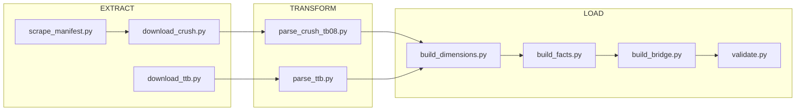
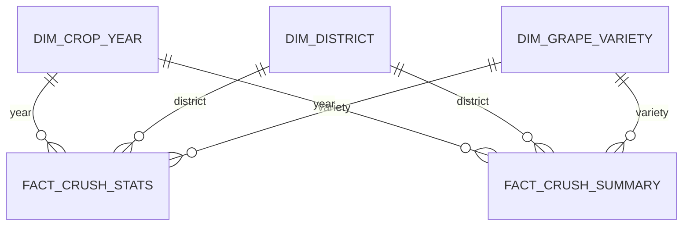

# USDA Grape Crush Statistics Pipeline

Repeatable data pipeline that ingests USDA NASS California Grape Crush statistics into raw, normalized, and analytical layers.

Most users can simply use the prebuilt CSVs in `data/final/` without running the pipeline. If you want to reproduce or update the dataset, follow the setup and pipeline instructions below.

## Prerequisites

- **Python**: 3.11+ (the repo and CI are tested on 3.11)
- **pip**: any recent version
- **Git**: to clone the repository
- **Make**: optional, only needed if you want to use the `Makefile` targets instead of `python -m ...`
- **Internet access**: only required if you plan to run the extract step to download fresh data

Optional:

- **NASS QuickStats API key** — needed only if you want to pull NASS QuickStats data:
  - Request a key from `https://quickstats.nass.usda.gov/api`
  - Export it as `NASS_API_KEY` in your shell environment before running the pipeline

## Data Sources

- **[USDA NASS Grape Crush Reports](https://www.nass.usda.gov/Statistics_by_State/California/Publications/Specialty_and_Other_Releases/Grapes/Crush/Reports/index.php)** — Primary source. Annual crush statistics by district, variety, and price bucket (2000–2024).
- **[TTB Wine Statistics](https://www.ttb.gov/statistics)** — Wine production volumes by state (placeholder).
- **[NASS QuickStats API](https://quickstats.nass.usda.gov/api)** — National grape/wine statistics (optional, requires API key).

## Local Setup

Clone the repo and create a virtual environment:

```bash
git clone https://github.com/crtjer/usda-data-crush-stats.git
cd usda-data-crush-stats

# (Recommended) create a virtual environment
python -m venv .venv
source .venv/bin/activate  # On Windows: .venv\Scripts\activate
```

Install Python dependencies:

```bash
pip install -r requirements.txt
```

At this point you can:

- **Analyze the shipped data only** (no internet or API keys needed): load the CSVs in `data/final/` with pandas, R, Excel, DuckDB, etc.
- **Or** run the full pipeline as described below to download and rebuild everything.

## Quick Start (Run the Pipeline)

Run via module (preferred, matches GitHub Actions):

```bash
# Run full pipeline (default 2000–2024)
python -m pipeline.run

# Run for specific year ranges
python -m pipeline.run --years 2022-2024

# Run single year
python -m pipeline.run --year 2024

# Skip download (use cached raw files)
python -m pipeline.run --skip-extract

# Force re-download
python -m pipeline.run --force
```

Or use Make:

```bash
make pipeline    # Full run
make extract     # Download only
make transform   # Parse only
make final       # Build gold layer only
make validate    # Run validation only
make clean       # Remove raw + silver data
```

## Pipeline Architecture



## Output Files (`data/final/`)

| File | Description | Grain |
|------|-------------|-------|
| `dim_district.csv` | 17 CA grape pricing districts + state total | — |
| `dim_grape_variety.csv` | All grape varieties with type/category | — |
| `dim_crop_year.csv` | Crop years with report metadata | — |
| `fact_crush_stats.csv` | Crush data rows: year/district/variety/brix bucket | Year × District × Variety × Brix |
| `fact_crush_summary.csv` | Summary rows: year/district/variety aggregated | Year × District × Variety |
| `fact_acreage.csv` | Bearing acreage by variety (placeholder) | Year × Variety |
| `fact_ttb_wine.csv` | TTB wine production (placeholder) | Year × State × Type |
| `bridge_crush_to_wine.csv` | Crush tons → wine production cross-reference | Year |
| `validation_report.json` | Data quality check results | — |

## Data Model (ERD)



## Example Usage

```python
import pandas as pd

# Load data
stats = pd.read_csv("data/final/fact_crush_stats.csv")
varieties = pd.read_csv("data/final/dim_grape_variety.csv")

# Top 10 wine grape varieties by price in 2024
wine_2024 = stats[(stats["crop_year"] == 2024) & (stats["grape_type_code"].isin([6, 7]))]
top_price = (wine_2024.groupby("variety_code")
    .agg(avg_price=("wt_price_per_ton", "mean"), total_tons=("tons_crushed", "sum"))
    .sort_values("avg_price", ascending=False)
    .head(10)
    .merge(varieties[["variety_code", "variety_name"]], on="variety_code"))
print(top_price[["variety_name", "avg_price", "total_tons"]])
```

## Documentation

- [Data Dictionary](docs/data_dictionary.md) — Column descriptions, types, and data quirks
- [EPIC Spec](EPIC.md) — Full pipeline specification

If you only want to *use* the data and not run ETL:

- The canonical analytical tables are already versioned under `data/final/` (see table below).
- The **Data Dictionary** documents every column, type, and known quirk.
- You can ignore `data/raw/`, `data/silver/`, and the `pipeline/` code entirely.

## Scheduling

GitHub Actions runs annually on March 15 (after NASS Final report publishes):
- Cron: `0 10 15 3 *`
- Manual dispatch available with optional year parameter

To use the workflow in your own fork:

- Ensure the default branch has this repo structure.
- (Optional) Add a `NASS_API_KEY` repository secret if you want QuickStats data to be refreshed; without it, the QuickStats step is skipped gracefully.
- The workflow:
  - Checks out the repo
  - Sets up Python 3.11 and installs `requirements.txt`
  - Runs `python -m pipeline.run` (or `--year <YEAR>` if provided)
  - Commits updated `data/final/` artifacts back to the repository and creates a release on success

## License

Data sourced from USDA NASS (public domain) and TTB (public domain).
