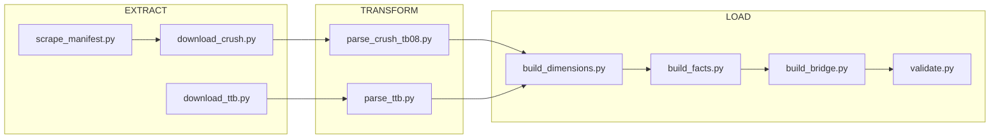
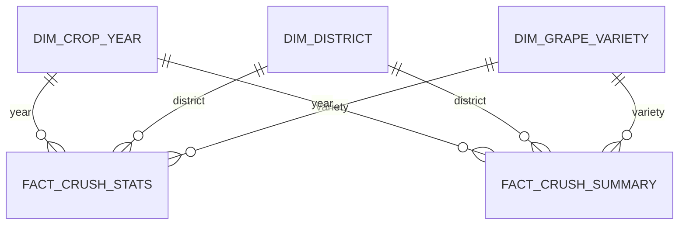

# USDA Grape Crush Statistics Pipeline

Repeatable data pipeline that ingests USDA NASS California Grape Crush statistics into raw, normalized, and analytical layers.

## Data Sources

- **[USDA NASS Grape Crush Reports](https://www.nass.usda.gov/Statistics_by_State/California/Publications/Specialty_and_Other_Releases/Grapes/Crush/Reports/index.php)** — Primary source. Annual crush statistics by district, variety, and price bucket (2000–2024).
- **[TTB Wine Statistics](https://www.ttb.gov/statistics)** — Wine production volumes by state (placeholder).
- **[NASS QuickStats API](https://quickstats.nass.usda.gov/api)** — National grape/wine statistics (optional, requires API key).

## Quick Start

```bash
# Install dependencies
pip install -r requirements.txt

# Run full pipeline (2000–2024)
python -m pipeline.run

# Run for specific years
python -m pipeline.run --years 2022-2024

# Run single year
python -m pipeline.run --year 2024

# Skip download (use cached raw files)
python -m pipeline.run --skip-extract

# Force re-download
python -m pipeline.run --force
```

Or use Make:

```bash
make pipeline    # Full run
make extract     # Download only
make transform   # Parse only
make final       # Build gold layer only
make validate    # Run validation only
make clean       # Remove raw + silver data
```

## Pipeline Architecture



## Output Files (`data/final/`)

| File | Description | Grain |
|------|-------------|-------|
| `dim_district.csv` | 17 CA grape pricing districts + state total | — |
| `dim_grape_variety.csv` | All grape varieties with type/category | — |
| `dim_crop_year.csv` | Crop years with report metadata | — |
| `fact_crush_stats.csv` | Crush data rows: year/district/variety/brix bucket | Year × District × Variety × Brix |
| `fact_crush_summary.csv` | Summary rows: year/district/variety aggregated | Year × District × Variety |
| `fact_acreage.csv` | Bearing acreage by variety (placeholder) | Year × Variety |
| `fact_ttb_wine.csv` | TTB wine production (placeholder) | Year × State × Type |
| `bridge_crush_to_wine.csv` | Crush tons → wine production cross-reference | Year |
| `validation_report.json` | Data quality check results | — |

## Data Model (ERD)



## Example Usage

```python
import pandas as pd

# Load data
stats = pd.read_csv("data/final/fact_crush_stats.csv")
varieties = pd.read_csv("data/final/dim_grape_variety.csv")

# Top 10 wine grape varieties by price in 2024
wine_2024 = stats[(stats["crop_year"] == 2024) & (stats["grape_type_code"].isin([6, 7]))]
top_price = (wine_2024.groupby("variety_code")
    .agg(avg_price=("wt_price_per_ton", "mean"), total_tons=("tons_crushed", "sum"))
    .sort_values("avg_price", ascending=False)
    .head(10)
    .merge(varieties[["variety_code", "variety_name"]], on="variety_code"))
print(top_price[["variety_name", "avg_price", "total_tons"]])
```

## Documentation

- [Data Dictionary](docs/data_dictionary.md) — Column descriptions, types, and data quirks
- [EPIC Spec](EPIC.md) — Full pipeline specification

## Scheduling

GitHub Actions runs annually on March 15 (after NASS Final report publishes):
- Cron: `0 10 15 3 *`
- Manual dispatch available with optional year parameter

## License

Data sourced from USDA NASS (public domain) and TTB (public domain).
