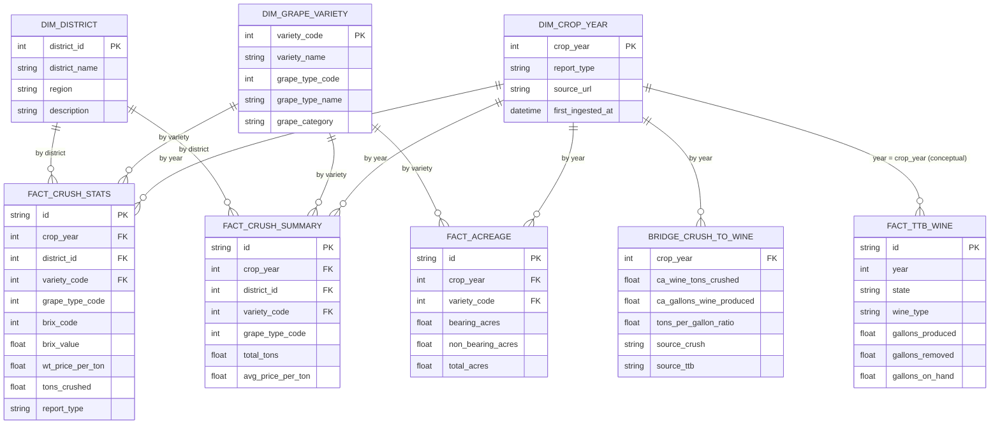

## Entity Relationship Diagram

```mermaid
erDiagram
    DIM_DISTRICT {
        int district_id PK
        string district_name
        string region
        string description
    }

    DIM_GRAPE_VARIETY {
        int variety_code PK
        string variety_name
        int grape_type_code
        string grape_type_name
        string grape_category
    }

    DIM_CROP_YEAR {
        int crop_year PK
        string report_type
        string source_url
        datetime first_ingested_at
    }

    FACT_CRUSH_STATS {
        string id PK
        int crop_year FK
        int district_id FK
        int variety_code FK
        int grape_type_code
        int brix_code
        float brix_value
        float wt_price_per_ton
        float tons_crushed
        string report_type
    }

    FACT_CRUSH_SUMMARY {
        string id PK
        int crop_year FK
        int district_id FK
        int variety_code FK
        int grape_type_code
        float total_tons
        float avg_price_per_ton
    }

    FACT_ACREAGE {
        string id PK
        int crop_year FK
        int variety_code FK
        float bearing_acres
        float non_bearing_acres
        float total_acres
    }

    FACT_TTB_WINE {
        string id PK
        int year
        string state
        string wine_type
        float gallons_produced
        float gallons_removed
        float gallons_on_hand
    }

    BRIDGE_CRUSH_TO_WINE {
        int crop_year FK
        float ca_wine_tons_crushed
        float ca_gallons_wine_produced
        float tons_per_gallon_ratio
        string source_crush
        string source_ttb
    }

    DIM_DISTRICT      ||--o{ FACT_CRUSH_STATS    : "by district"
    DIM_GRAPE_VARIETY ||--o{ FACT_CRUSH_STATS    : "by variety"
    DIM_CROP_YEAR     ||--o{ FACT_CRUSH_STATS    : "by year"

    DIM_DISTRICT      ||--o{ FACT_CRUSH_SUMMARY  : "by district"
    DIM_GRAPE_VARIETY ||--o{ FACT_CRUSH_SUMMARY  : "by variety"
    DIM_CROP_YEAR     ||--o{ FACT_CRUSH_SUMMARY  : "by year"

    DIM_GRAPE_VARIETY ||--o{ FACT_ACREAGE        : "by variety"
    DIM_CROP_YEAR     ||--o{ FACT_ACREAGE        : "by year"

    DIM_CROP_YEAR     ||--o{ BRIDGE_CRUSH_TO_WINE : "by year"

    DIM_CROP_YEAR     ||--o{ FACT_TTB_WINE       : "year = crop_year (conceptual)"
```

